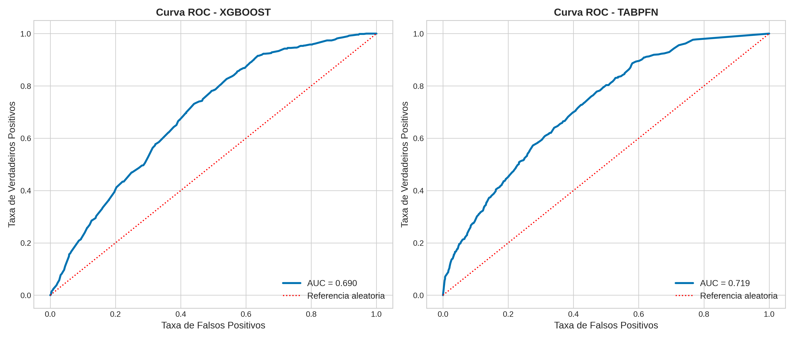
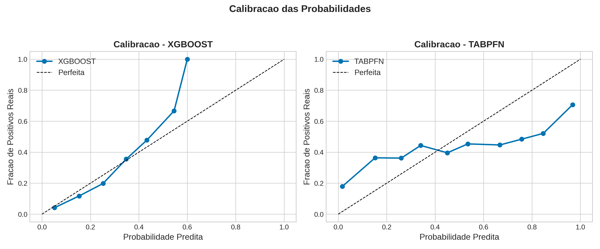
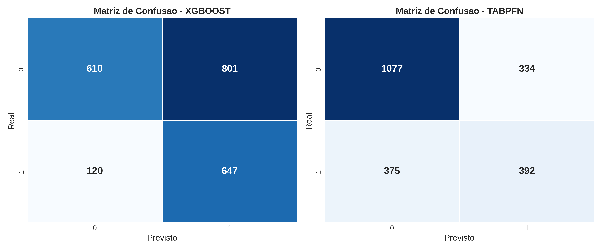
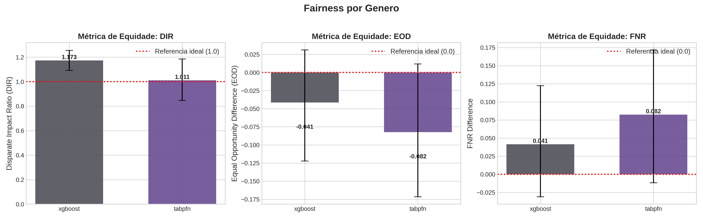
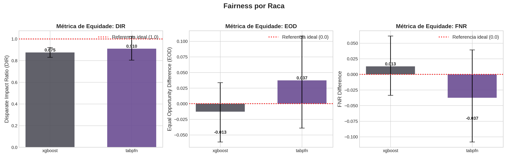

# Resultados e Discussão

## Desempenho Preditivo

A tabela abaixo sumariza os resultados de desempenho preditivo obtidos por validação cruzada estratificada com $K=10$ partições sobre $N = 2.178$ candidaturas.

| Modelo  | MCC   | $\sigma$ | AUC-ROC | $\tau^*$ médio |
|---------|-------|----------|---------|----------------|
| XGBoost | 0,275 | 0,032    | 0,685   | 0,27           |
| TabPFN  | 0,279 | 0,072    | 0,719   | 0,41           |

Ambos os modelos apresentaram desempenho preditivo moderado, compatível com a natureza ruidosa de dados eleitorais baseados exclusivamente em atributos sociodemográficos pré-eleitorais. O XGBoost obteve MCC médio de $0,275 \pm 0,032$, enquanto o TabPFN atingiu $0,279 \pm 0,072$. Embora o TabPFN apresente AUC-ROC ligeiramente superior (0,719 vs. 0,685), a maior variância entre *folds* ($\sigma = 0,072$) indica menor estabilidade preditiva.

*Figura 1 – Curvas ROC dos modelos XGBoost (AUC = 0,685) e TabPFN (AUC = 0,719).*

O limiar ótimo de classificação ($\tau^*$), calibrado por maximização do MCC em cada *fold*, diferiu substancialmente entre os modelos: $\tau^*_{XGB} = 0,27$ contra $\tau^*_{TabPFN} = 0,41$. Essa diferença reflete a distribuição de probabilidades preditas: o XGBoost concentra predições em faixas mais baixas, enquanto o TabPFN apresenta distribuição mais dispersa.

*Figura 2 – Diagramas de calibração das probabilidades preditas.*

O XGBoost apresenta calibração monotônica até $p \approx 0,6$; o TabPFN exibe maior dispersão e tendência a subestimar probabilidades altas.

*Figura 3 – Matrizes de confusão agregadas.*

As matrizes de confusão revelam estratégias preditivas distintas: o XGBoost favorece a classe positiva (eleito), gerando mais falsos positivos (879 vs. 334), enquanto o TabPFN é mais conservador, com maior número de falsos negativos (375 vs. 92).

---

## Testes Estatísticos

| Teste              | Estatística | p-valor                 |
|--------------------|-------------|-------------------------|
| Wilcoxon (pareado) | W = 27,0    | 1,000                   |
| Cohen d            | 0,059       | IC-95%: [−0,573; 1,083] |
| McNemar            | $\chi^2$ = 79,77 | < 0,001            |

O teste de Wilcoxon pareado ($W = 27,0$, $p = 1,000$) e o tamanho de efeito Cohen $d = 0,059$ (IC-95%: [−0,573; 1,083]) confirmam a ausência de diferença estatisticamente significativa no MCC entre os modelos. O intervalo de confiança do Cohen $d$ inclui zero, indicando equivalência prática.

Contudo, o teste de McNemar ($\chi^2 = 79,77$, $p < 0,001$) revela discordância significativa nas predições individuais: o TabPFN acertou 558 instâncias que o XGBoost errou, enquanto o XGBoost acertou 296 instâncias que o TabPFN errou. Essa assimetria indica que, embora o desempenho agregado seja equivalente, os modelos cometem erros em subconjuntos distintos da população — um achado relevante para análise de equidade.

---

## Equidade Algorítmica por Gênero

**Tabela 1** – Métricas de equidade por gênero (privilegiado: masculino, $n=1.845$; não-privilegiado: feminino, $n=333$)

| Modelo  | DIR   | IC-95% DIR     | EOD    | IC-95% EOD      | $\Delta$FNR | IC-95% $\Delta$FNR |
|---------|-------|----------------|--------|-----------------|-------------|--------------------|
| XGBoost | 1,176 | [1,107; 1,241] | −0,012 | [−0,076; 0,044] | 0,012       | [−0,044; 0,076]    |
| TabPFN  | 1,011 | [0,847; 1,185] | −0,082 | [−0,172; 0,012] | 0,082       | [−0,012; 0,172]    |

*Figura 4 – Métricas de equidade por gênero: DIR, EOD e $\Delta$FNR com intervalos de confiança de 95%.*

O XGBoost apresentou DIR = 1,176 (IC-95%: [1,107; 1,241]), indicando que o modelo prevê candidatas femininas como eleitas com taxa 17,6% superior à taxa para candidatos masculinos. O intervalo de confiança não inclui 1,0, configurando disparidade estatisticamente significativa.

Este resultado aparentemente paradoxal — viés "favorável" ao grupo minoritário — reflete um padrão empiricamente presente nos dados: mulheres representam apenas 15,3% das candidaturas ($n=333$ de 2.178), mas as que se candidatam são eleitas em proporção ligeiramente superior em 3 dos 4 ciclos eleitorais analisados. O XGBoost amplifica esse padrão histórico de auto-seleção; o TabPFN, com DIR = 1,011 (IC-95%: [0,847; 1,185]), mantém neutralidade relativa.

A questão normativa subjacente é: deve um modelo amplificar padrões históricos de seleção enviesada (XGBoost) ou manter neutralidade preditiva (TabPFN)? Essa tensão constitui contribuição empírica relevante para o debate sobre *fairness* algorítmica.

---

## Equidade Algorítmica por Raça

**Tabela 2** – Métricas de equidade por raça (privilegiado: branca, $n=792$; não-privilegiado: não-branca, $n=1.386$)

| Modelo  | DIR   | IC-95% DIR     | EOD    | IC-95% EOD      | $\Delta$FNR | IC-95% $\Delta$FNR |
|---------|-------|----------------|--------|-----------------|-------------|--------------------|
| XGBoost | 0,875 | [0,831; 0,921] | −0,013 | [−0,061; 0,034] | 0,013       | [−0,034; 0,061]    |
| TabPFN  | 0,910 | [0,804; 1,024] | 0,037  | [−0,039; 0,108] | −0,037      | [−0,108; 0,039]    |

*Figura 5 – Métricas de equidade por raça: DIR, EOD e $\Delta$FNR com intervalos de confiança de 95%.*

Ambos os modelos apresentaram DIR < 1 para raça, indicando subpredição para candidatos não-brancos. O XGBoost registrou DIR = 0,875 (IC-95%: [0,831; 0,921]), com intervalo que não inclui 1,0, configurando disparidade estatisticamente significativa. O TabPFN apresentou DIR = 0,910 (IC-95%: [0,804; 1,024]), com intervalo que inclui 1,0, indicando ausência de disparidade estatisticamente significativa.

Quanto às métricas de oportunidade equalizada (EOD e $\Delta$FNR), ambos os modelos apresentaram valores próximos de zero com intervalos que incluem o valor ideal, sugerindo paridade aproximada nas taxas de verdadeiros positivos e falsos negativos entre grupos raciais.

---

## Análise de Sensibilidade

### Sensibilidade ao Limiar

A variação do limiar de classificação ($\tau \pm 0,05$) produziu impactos distintos nas métricas de equidade:

| Modelo  | Atributo | $\tau$ médio | $\Delta$DIR | $\Delta$EOD | Status |
|---------|----------|--------------|-------------|-------------|--------|
| XGBoost | Gênero   | 0,27         | 0,010       | 0,013       | OK     |
| XGBoost | Raça     | 0,27         | 0,011       | 0,026       | ALERTA |
| TabPFN  | Gênero   | 0,41         | 0,039       | 0,020       | ALERTA |
| TabPFN  | Raça     | 0,41         | 0,001       | 0,011       | OK     |

O XGBoost apresentou alerta para raça ($\Delta$EOD = 0,026 > 0,02), enquanto o TabPFN apresentou alerta para gênero ($\Delta$DIR = 0,039 > 0,02). Esses resultados indicam que as métricas de equidade de ambos os modelos são moderadamente sensíveis à escolha do limiar de decisão.

### Sensibilidade à Exclusão de 2012

O TSE não coletava autodeclaração racial sistematizada em 2012, resultando em 649 candidaturas (29,8% do dataset) com raça não especificada. A análise de sensibilidade excluindo esse ciclo ($N = 1.529$) revelou:

| Modelo  | DIR completo | DIR sem 2012 | $\Delta$DIR | Classificação |
|---------|--------------|--------------|-------------|---------------|
| XGBoost | 0,875        | 0,938        | 0,063       | Substantivo   |
| TabPFN  | 0,910        | 0,921        | 0,011       | Marginal      |

O impacto substantivo no XGBoost ($\Delta$DIR = 0,063 > 0,05) indica que parte da disparidade racial detectada é confundida pelo componente temporal 2012–2024 e pela não-observabilidade racial daquele ciclo. O TabPFN demonstra maior robustez a essa limitação dos dados ($\Delta$DIR = 0,011). As métricas de *fairness* racial devem ser interpretadas como limite inferior plausível da disparidade real.

---

## Síntese e Implicações

Os resultados demonstram empiricamente que dois classificadores arquiteturalmente distintos podem atingir acurácia estatisticamente equivalente (MCC $\approx$ 0,28; Wilcoxon $p = 1,0$; Cohen $d = 0,06$), mas produzir perfis de equidade mensuravelmente diferentes:

- **Gênero**: O XGBoost amplifica o padrão histórico de auto-seleção (DIR = 1,18); o TabPFN mantém neutralidade (DIR $\approx$ 1,01).
- **Raça**: O XGBoost apresenta disparidade significativa (DIR = 0,88); o TabPFN não apresenta disparidade estatisticamente significativa (DIR = 0,91, IC inclui 1,0).

A assimetria revelada pelo teste de McNemar ($b = 558$, $c = 296$) indica que os modelos erram em subpopulações distintas, o que pode ter implicações práticas para sistemas de apoio à decisão: a combinação dos modelos (*ensemble*) poderia potencialmente melhorar tanto o desempenho quanto a equidade.

A escolha entre XGBoost e TabPFN, portanto, não é apenas técnica, mas carrega implicações éticas: o XGBoost reflete mais fielmente os padrões históricos dos dados (incluindo suas desigualdades estruturais), enquanto o TabPFN produz predições mais neutras em relação aos atributos protegidos. A definição de qual comportamento é "mais justo" depende do contexto de aplicação e dos valores normativos adotados pelo tomador de decisão.